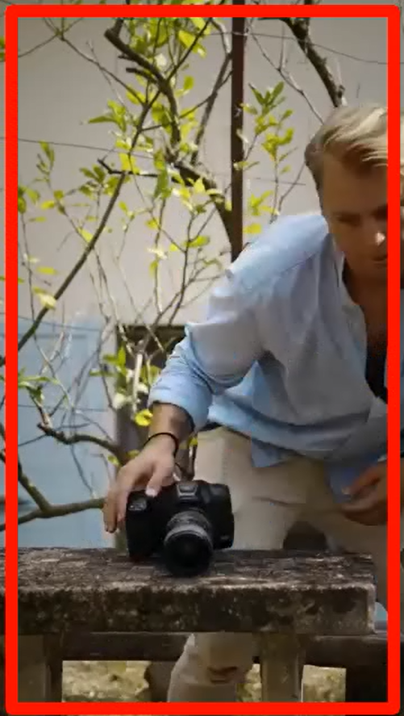
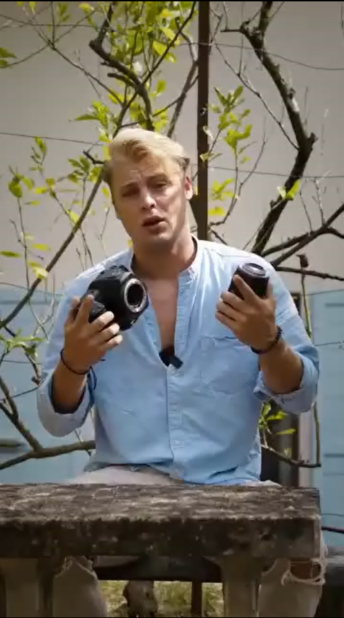

# Video Frame Quality Analysis

This Python application processes video files to extract frames and analyze their quality using blur detection and clustering techniques. It groups frames based on their distortion level and produces a report, histogram, and a new video with highlighted blurred frames.

## Features

- Extracts frames from a given video file.
- Analyzes each frame's quality based on motion blur using Laplacian variance.
- Clusters frames by quality using K-Means clustering.
- Identifies the most distorted frames and highlights them in a new video.

 ## Preview 

[Link to download highlighted blurred parts video](https://raw.githubusercontent.com/rusenaite/frame-quality-clustering/refs/heads/main/highlighted_video.mp4)




## Output Files

- Extracted Frames: `output_frames/frame_0001.jpg`, `frame_0002.jpg`, etc.
- Analysis Report: `output_frames/analysis_report.txt`
- Blur Distribution Chart: `output_frames/blur_analysis.png`
- Highlighted Video: `highlighted_video.mp4`

## Requirements

Required libraries and packages to run the project:
- OpenCV
- NumPy
- Matplotlib
- scikit-learn

## Usage

1. Update the `video_file` path in `process_video()` to specify your video file.
2. Run the script to extract frames, analyze them for motion blur, and generate output files.

## Installation

To install the required Python packages, you can run:

```bash
pip install opencv-python-headless numpy matplotlib scikit-learn